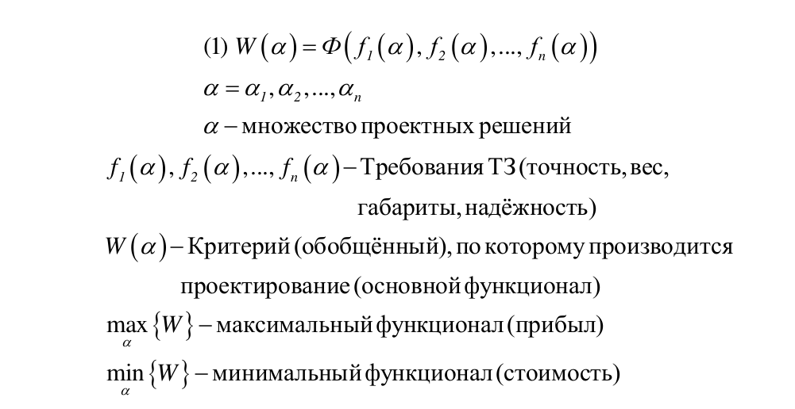
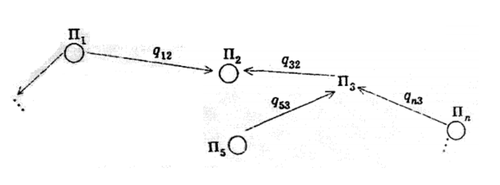
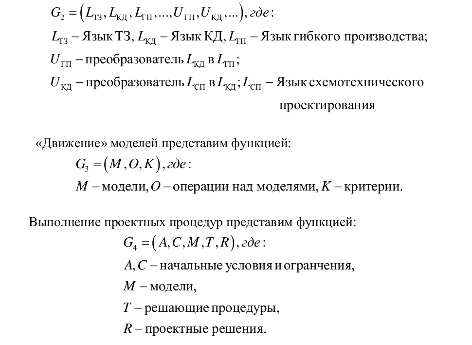

___
# Вопрос 10: Каким образом организуется «движение» цифровой модели от технического задания до опытного образца?
___

*Источники: Тема 2.doc*

Задача проектирования: выбрать в множестве a такое $$ a^* $$ , составляющие которого $$ a_1^*, a_2^*, ... $$ , такие что $$ a^* $$ является наилучшим по заданным критериям. Эта задача в общем случае не достижима, поэтому при проектировании решаются компромиссные задачи. Проектировщики стремятся найти такое множество проектных решений, которое с одной стороны удовлетворяет требованиям ТЗ, а с другой стороны не противоречит основным критериям.

Для решения компромиссной задачи привлекаются математические методы и алгоритмы.

Во всем процессе проектирования и производства существуют понятия проектной процедуры, проектной операции и проектного решения.
Проектные процедуры - часть процесса проектирования, состоящая из ряда проектных операций над исходными данными и заканчивающаяся проектным решением.

Проектные операции - действия проектировщиков над исходными или промежуточными данными внутри проектной процедуры.

Проектное решение - окончательный или промежуточный результат проектирования.

Весь процесс проектирования строится из проектных процедур и соответственно проектных решений. Именно проектные решения несут ответственность за соответствие объекта ТЗ. Ошибки проектных решений приводят к значительным финансовым наморальным потерям предприятия.

Проектное решение - функция от множества параметров.

Процесс проектирования можно представить графом из проектных процедур, $$ P_i $$, и связей между ними $$ q_{ij} $$.

Формализация процесса проектирования сводится к построению математических моделей их «движению» от ТЗ до получения опытного образца при обязательном лингвистическом и программном обеспечениях этого процесса.

Представление такой формализации с позиции теории множеств может быть в виде обобщённых функций $$ G_1, G_2, G_3, G_4 $$.
Общая функция процесса проектирования модет быть предствлена в виде: $$ G_1 = (V, R, W) $$, где :
* V - множество процедур проектирования,
* R - множество связей,
* W - правила построения связей.

Лингвистическое обеспечение включает преобразования (трансляторы), языков проектирования:

**Из консультации**

Нужно цифровую модель объекта проектирования и соответствующих устройств внутри этого объекта сразу же на уровне ТЗ и аванпроекта сформулировать.  
Цифровая модель в начале представляет собой достаточно приближенный образ будущего изделия.  
И дальше эта модель должна двигаться от технического задания до изготовления опытного образца. Двигаясь по этапам производства эта модель уточняется, корректируется (с обратными связями) и становится основой для всех проектных процедур и операций.  
Модель должна быть адекватна реальному образцу. Это задача идентификации. Если модель не точна, то цифровизация становится шаткой.