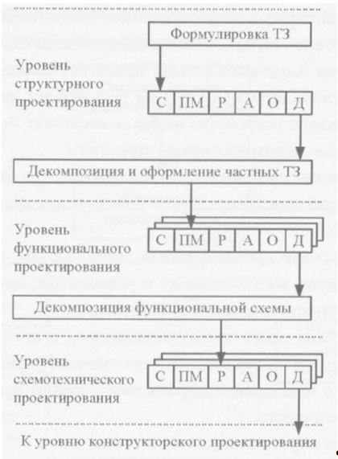
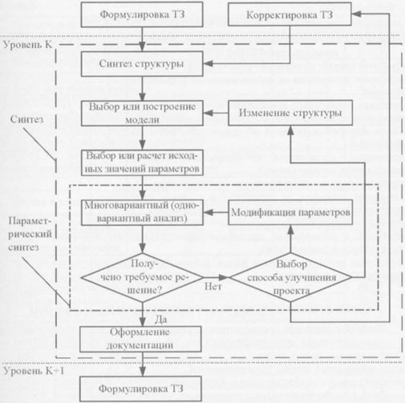

___
# Вопрос 16:	Каким образом осуществляется декомпозиция процессов проектирования и производства на отдельные процедуры?
___

*Источники: Тема 3.doc, Лекция 3*

### Декомпозиция со слов Сольницева
Декомпозиция процессов на предприятии на отдельные процедуры складывается традиционно на протяжении 10 лет. 
Пример, Электроавтоматика – сложилось представление отдельных подразделений, каждое из которых занимается своим делом. 
Кто-то делает аппаратную часть, кто-то программное обеспечение, кто-то обеспечивает испытание готовой ЭВМ перед сдачей заказчику, конструкторское подразделение.
На входе получает принципиальную эл.схему, на выходе выдает конструкторскую документацию. 
Распределение проекта по подразделением и есть декомпозиция.

### Декомпозиция в лекциях
В процессе проектирования сверху-вниз изделие наибольшего уровня слож¬ности разбивается (декомпозируется) на составные части (узлы, устройства, компоненты).
При этом для каждой составной части изделия, которую требу¬ется спроектировать, формируется частное техническое задание.
На уровне структурного проектирования производится декомпозиция и оформление частных технических заданий. 
Все изделие как правило разбивается на отдельные подсиситеы, узлы и детали. 
Например, на арифметическо-логический блок, долговременную память, быструю память, устройства ввода/вывода, вспомогательные блоки. А также программное обеспечение. 
На каждую составляющую часть пишется частное ТЗ. 
На уровне схемотехнического проектирования каждый блок проектируется отдельно 

### Уровни начальных этапов процесса проектирования
ТЗ - техническое задание, 
С - синтез, ПМ - построение модели, Р - расчет, А - анализ, О - оценка, 
Д - выпуск документации

Каждый этап проходит типовые проеткные процедуры

