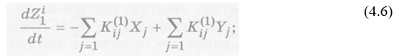
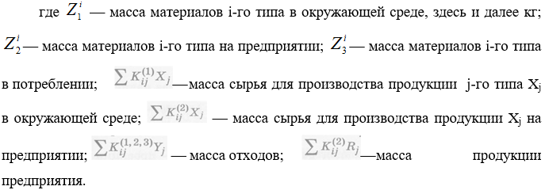
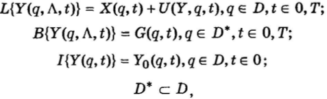

___
# Вопрос 19: Приведите примеры ММ КФС на МЕТАУРОВНЕ.
___

Система управления «Природа – Техногеника» (СУПТ).

При разработке метамоделей СУПТ можно использовать законы сохранения в виде уравнений баланса. Уравнения баланса могут представляться уравнениями материального, энергетического баланса, баланса равновесия сил.

Уравнение материального баланса основано на законе сохранения массы вещества и может быть представлено разностью между приходом и расходом вещества, равной изменению его количества в рассматриваемом объекте. 

Рассмотрим материальный баланс в системе “природа— техногеника” без управления.

Уравнения материального баланса для окружающей среды предприятия — источника ЗВ — и потребителя представим в следующем виде:

- окружающая среда —

- предприятие — источника ЗВ —

- потребители - 

Из уравнений (4.6)-(4.8) можно получить частный случай уравнения статики:

Рассмотренные здесь метамодели СУПТ используются при качественой оценке и моделировании ЗСУПТ.

Задача построения метамоделей в СУПТ значительно упрощается при рассмотрении каждого предприятия — источника ЗВ — с частью природы, прилегающей к этому предприятию. 

Более детальное представление КФС метауровне осуществляется посредством операторных уравнений, которые покажем на примере СУПТ.

СУПТ состоит из объекта управления (ОУ) и контура управления, под которым в общем случае понимается и управление разомкнутой СУПТ с человеком-оператором и лицом.

Математические модели СУПТ в общем случае чрезвычайно сложны, поскольку они должны включать такие подсистемы, как население, промышленные и сельскохозяйственные предприятия, в том числе предприятия по переработке отходов, жилищно-коммунальное хозяйство, транспорт, природные подсистемы — газовые, жидкостные, твердые с учетом взаимодействия физических полей, диффузий химических соединений. При этом важнейшей проблемой является разработка интерфейсов между математическими моделями различных подсистем.

Объект управления включает потоки ЗВ, распространяющиеся в окружающей природной среде от выхода с источника ЗВ до мест их измерения. Такой объект управления в общем случае описывается операторными уравнениями в классе уравнений с распределенными параметрами:	

где L — оператор, действующий из пространства X в пространство Y; В — оператор краевых условий; I — оператор на-чальных условий; Y — вектор выходных сигналов (различных ЗВ), распределенных по параметрам q, t; X — вектор входных воздействий на ОУ (продукция предприятия — источника ЗВ, сырье, энергия и т. д.), распределенных по параметрам q, t, Λ — параметры ОУ; q — пространственные параметры — координаты в земной системе координат.

Если входное воздействие Х(q, t) не находится в нашем распоряжении, то движение этой системы не будет управляемым и возможно лишь пассивное наблюдение за происходящими процессами. В частности, путем математического моделирования на ЭВМ можно получить функцию У(t). С другой стороны, если входное воздействие включает управление U(Y,q, t), то можно воздействовать на объект управления для достижения основной цели — минимизации ЗВ, поступающих в окружающую природную среду. В этом случае мы вправе выбирать и формировать управление по своему усмотрению — и наиболее эффективно путем построения СУПТ как САУ.

Здесь в отличие от пассивного наблюдения мы можем активно воздействовать на объект управления. С учетом этого последняя система примет вид:

Раскрытие операторов объектов управления L, В, I в формулах проводит к ММ с конкретной привязкой к объекту проектирования.