___
# Вопрос 20: Какие формы ММ в виде уравнений состояния существуют?
___

1. Уравнение материального баланса основано на законе сохранения массы вещества и может быть представлено разностью между приходом и расходом вещества. В стационарном режиме не может происходить ни убыль, ни накопление. В этом случае уравнение материального баланса для n-го количества вещества может быть записано в виде: 

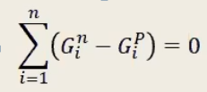

2. Вход и выход не уравновешены

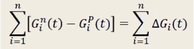

3. При определении статистических зависимостей можно воспользоваться интегральной записью уравнения материального баланса в следующей форме:

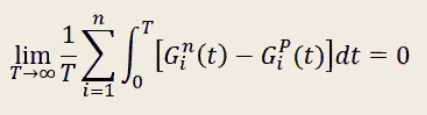

4. Несколько входов, один выход. Материальный баланс в переходном процессе, при котором поступают два потока веществ, а выходит один смешанный поток, может быть выражен как изменение количества вещества, находящегося в емкости, равное разности между количеством притекающих веществ и количеством вытекающего вещества за одно и то же время:

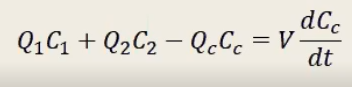

где Q1, Q2 — потоки поступления в смешивающее устройство 1-го и 2-го потоков веществ соответственно; C1, С2 — концентрации веществ в 1-м и во 2-м приходящих потоках; Qc, Сс — расход вещества из емкости и его концентрация соответственно; V — объем смешивающего устройства.

Не менее редко, чем материальный баланс, применяется энергетический баланс, основанный на законе сохранения энергии. В установившемся режиме количество энергии, притекающей в объект, равно количеству энергии, уходящей из него.
Уравнения материального баланса для окружающей среды предприятия — источника ЗВ (загрязняющих веществ) — и потребителя представим в следующем виде:
1. Окуржающая среда:

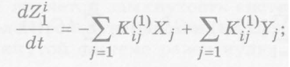 (1.1)

2. Предприятие — источник ЗВ:

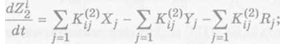 (1.2)

3. Потребители: 

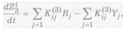 (1.3)

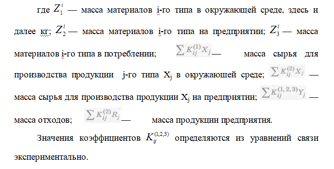

Из уравнений (1.1)-(1.3) можно получить частный случай уравнения статики:

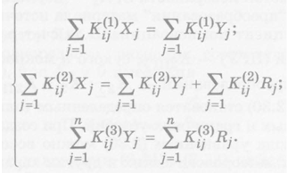

Если мы рассматриваем объект управления, который нужно описать ММ, то в общем случае ММ будет выглядеть так:

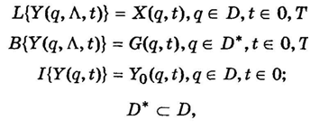

где L — оператор, действующий из пространства X в пространство Y; В — оператор краевых условий; I — оператор начальных условий; Y — вектор выходных сигналов (различных ЗВ), распределенных по параметрам q, t; X — вектор входных воздействий на ОУ (продукция предприятия — источника ЗВ, сырье, энергия и т. д.), распределенных по параметрам q, t, Λ — параметры ОУ; q — пространственные параметры — координаты в земной системе координат.
Если входное воздействие Х(q, t) не находится в нашем распоряжении, то движение этой системы не будет управляемым и возможно лишь пассивное наблюдение за происходящими процессами. С другой стороны, если входное воздействие включает управление U(Y,q, t), то можно воздействовать на объект управления для достижения основной цели — минимизации ЗВ.
Здесь в отличие от пассивного наблюдения мы можем активно воздействовать на объект управления. С учетом этого система примет следующий вид:

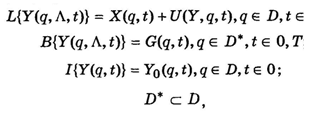

Однако описанные модели слишком сложны и нуждаются в упрощении. От них требуется перейти к более простой математической форме. Более простой формой является следующая форма (стохастическое дифференциальное уравнение): 

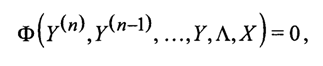

где Ф - вещественная вектор-функция своих аргументов;  Y - выходная величина; X - входная величина; Λ - вектор параметров системы. 
Дальнейшее упрощение осуществляется переходом к форме Коши:

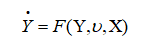