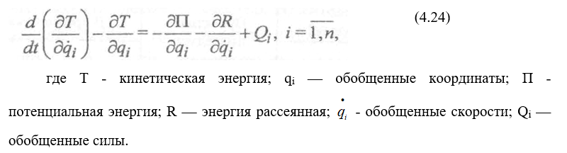

# Вопрос 22: Какие основные операции построения ММ в аналитическом виде Вы знаете?
___

Вручную выводить ММ (математической модели) на данный момент уже нецелесообразно. Необходимо решить, на основе какого основного операторного уравнения осуществляется вывод (операторное уравнение Лагранжа второго порядка, например)

На основании этого уравнения ЭВМ должны выполнять:
* умножение полинома на полином
* дифференцирование
* приведение подобных членов

В общем случае выбор метода и алгоритмов построения ММ на ЭВМ в аналитическом виде подчиняется зависимости:

min{F = G / H},

где G — количество операций исходного алгоритма, представленных на выбранном языке аналитических преобразований; Н — количество операторов этого средства аналитических преобразований. Анализ большого круга методов и алгоритмов показал, что с позицией критерия представленного выше, простоты подготовки исходных данных, «длины» программы, времени «счета» преимущества имеет **метод Лагранжа** на основе формализма вида

Уравнение (4.24) можно применять к любым системам, где есть перечисленные виды энергии.
Для того чтобы вывести уравнение любого объекта, необходимо проделать в соответствии с уравнением (4.24) следующие основные операции:

1.	Составить выражения для энергий Т, П, R и обобщенной силы $$Q_i$$.

2.	Произвести операции дифференцирования 

3.	Осуществить приведение подобных членов.

Очевидно, что для сложных объектов эти операции громоздкие и приводят к ошибкам при ручном выводе ММ. Например, ММ летательного аппарата, судна, турбины, навигационного прибора в форме обыкновенных дифференциальных уравнений достигают порядков n > 20 с сотнями членов уравнений.
Для электрических схем в качестве обобщенных координат и скоростей выступают заряд и ток. Элементарная электрическая цепь является аналогом механического элемента, а индуктивность L, емкость С, сопротивление R, приложенное напряжение Е(t) - аналоги параметров m, 1/k, h, F(t) механического элемента. 

Подготовка соответствующих уравнений Лагранжа (4.24) электрических объектов сводится к определению контуров, назначению в виде обобщенных координат и скоростей соответствующих зарядов и токов, а также обобщенных сил - напряжений.

Пакет программ «Построение ММ» позволяет строить ММ объектов с различной степенью приближения: нелинейные, линейные в 1-м приближении и линейные во 2-м приближении. В этот пакет включена соответствующая подсистема упрощения. Ядро пакета содержит операции дифференцирования, умножения полинома на полином, возведение в степень, приведение подобных членов и другие математические операции.
