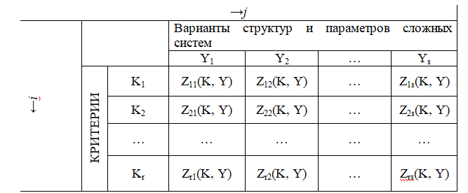
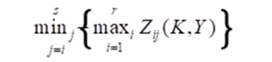
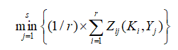
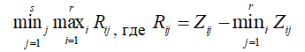
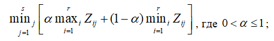

___
# Вопрос 24: Каким образом применяется «ПЛАТЁЖНАЯ МАТРИЦА» к анализу КФС?
___

Метод платежных матриц используется при декомпозиции сложной киберфизической системы на подсистемы. 
В качестве исходных данных используются два вектора: 
вектор критериев K=|K1, K2, …, Kr|
вектор решений Y=|Y1, Y2, …, Ys| 
Где i, j - номера вариант наборов составляющих векторов Ki и Yj.
Также вводится оценочная функция Z(K, У):

Для каждого варианта по каждому критерию производится оценка. Таким образом вся матрица заполняется численными значениями.
После того, как матрица заполнилась, применяется усредняющий критерий (так как нужно выбрать лучший вариант из множества):
1. Критерий Вальда (критерий минимальных затрат)

2. Критерий Лапласа (критерий минимума среднеарифметических затрат)

3. Критерий Сэвиджа (критерий минимаксного риска)

4. Критерий Гурвица (критерий «пессимизма - оптимизма») 

при а = 1 – получаем критерий Вальда;
при а = 0 – получаем критерий крайнего оптимизма - лучшее стечение обстоятельств.
