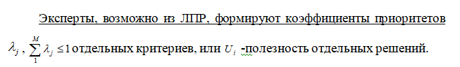
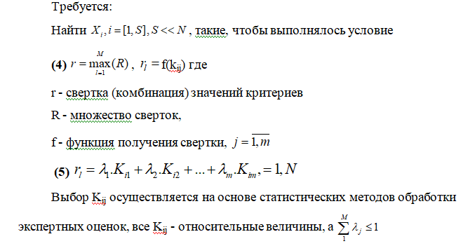
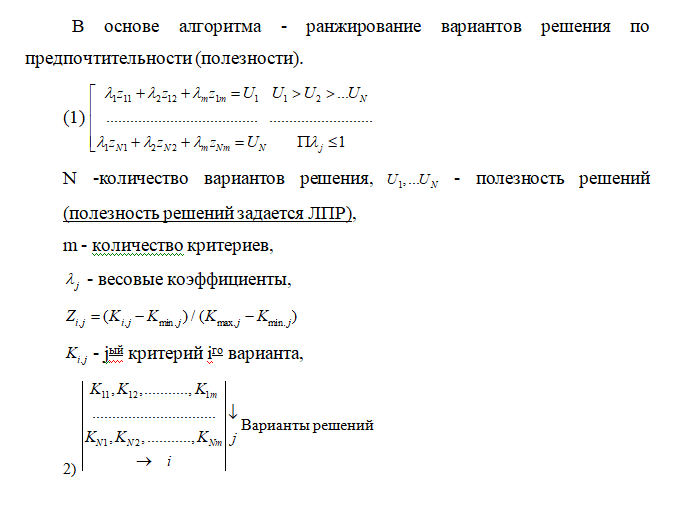
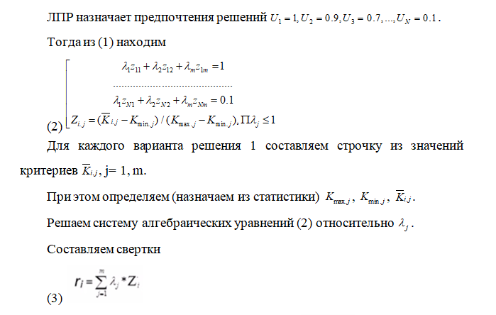
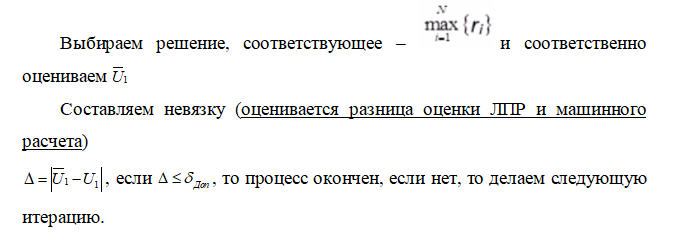

___
# Вопрос 25: Перечислите операции алгоритма принятия проектного решения ЛПР?
___

Исходные данные при постановке задачи: 
(1)  П={Xi=(x1, x2,…, xn)}, i=1,N
-множество возможных решений (возможных заказов, проектов, технических процессов, принятия решений и т.п.),
n - количество характеристик, признаков i-го решения (технические, маркетинговые и т.д.)
(2) K= (K1, …, Km)
-показатель эффективности => множество критериев формирования П, качество, надежность масса, габариты и т.д.
(3) O=(O1, O2, ...,Or)
-множество ограничений формирования П при заданном К (стоимость, мощность, вес, габариты и т.д.)

Данные приоритеты сложно сформировать на начальном этапе. При большом количестве данных параметров ЛПР не может учитывать их все. Но ЛПР может сразу определить из личного опыта, насколько одно решение полезно или бесполезно. Такая ранняя оценка может облегчить формирование других приоритетов и их дальнейшее оценивание.

Требуется найти варианты, комбинация свойств которых будет наилучшей. Иначе:

**Информация с консультации:*

1. Определяется представительный набор критериев
2. Определяется представительный набор возможных решений
3. Лицо, принимающее решение, назначает предпочтительность одного варианта решения перед другими

"Предпочтительность" представляется в виде алгебраического уравнения, неизвестными в котором явлюятся весовые коэффициенты

Путем решения алгебраического уравнения находятся весовые коэффициенты.

Затем итеррационным методом получается решение близкое к истинному.

