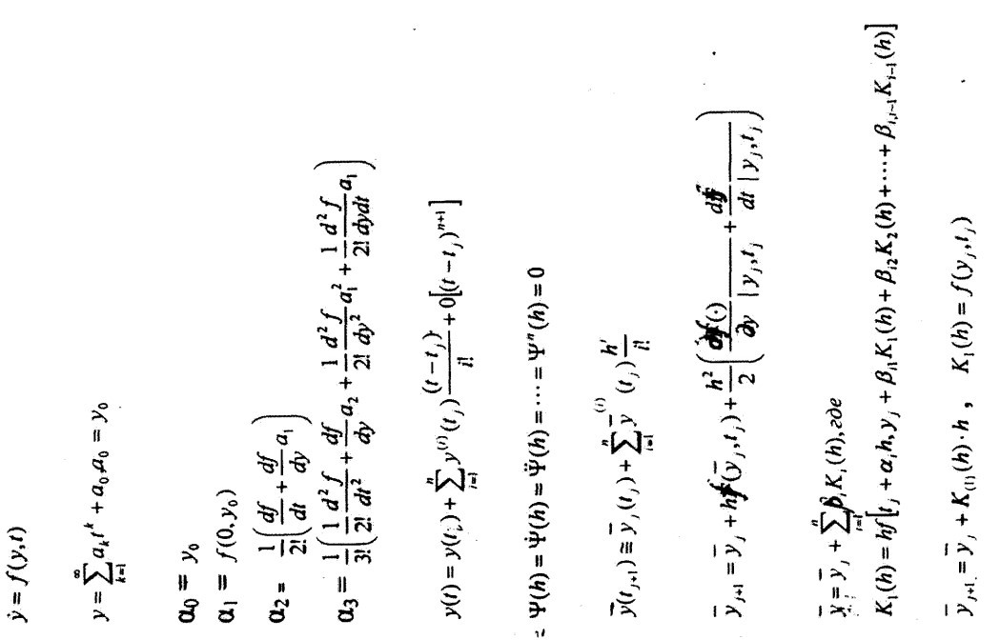
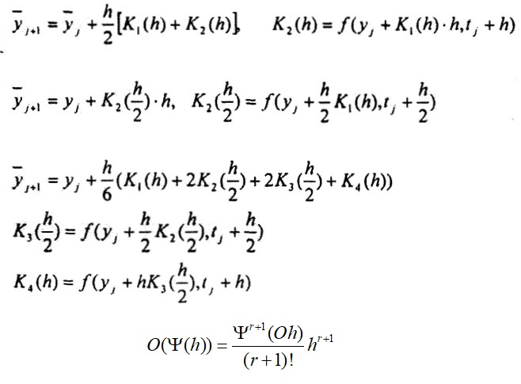
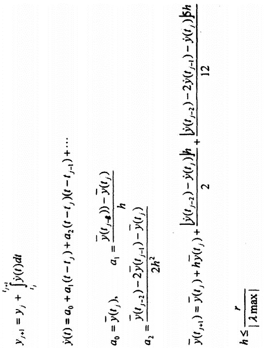

___
# Вопрос 26: Какие численные методы решения задачи КОШИ Вы знаете
___

Источник: Лекции, Тема 5.doc, с. 8.

## Численные методы и алгоритмы строятся на основе разложения в ряды Тейлора

## Экстраполяционные численные методы Трапецией, Рунге-Кутта

## Интерполяционные методы Адама-Штермера

## Интерполяционные методы Гира

## Системные методы Ракитного

## Информация с кольсультации

[Жёсткая система](https://ru.wikipedia.org/wiki/Жёсткая_система) - система для решения которой явные методы являются менее производительными, чем неявные за счёт увеличения числа вычислений при малом шаге интегрирования и резкого возрастания погрешности  при недостаточно малом шаге. [Ещё немного про жёсткие системы и А-устойчивость](http://w.ict.nsc.ru/books/textbooks/akhmerov/nm-ode_unicode/1-8.html).

*Интерполяция* (по-простому) - нахождение промежуточного значения между двумя известными.

*Экстраполяция* (по-простому) - нахождение следующего значения по известным предыдущим.