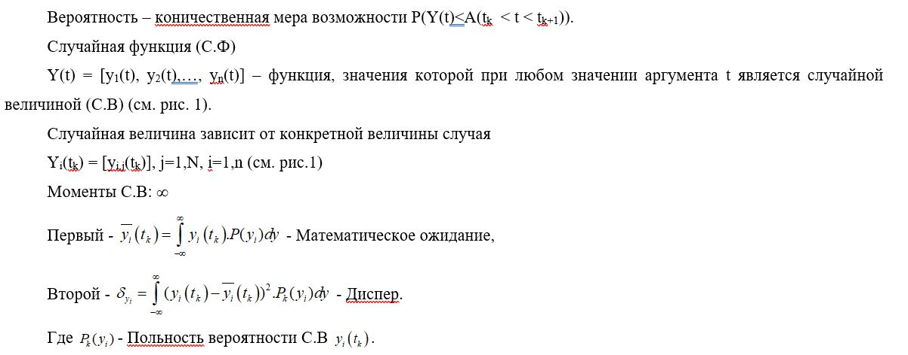

___
# Вопрос 28: Дайте определения случайных величин, процессов и их вероятностных характеристик
___

Источник: Лекции, Тема 6.doc.

Макроскопические оценки в процессе проектирования и производства	 КФС осуществляются по измеряемым выходным переменным, $ Y(t) = (y_1 … y_n) $.
- Механическим, перемещения, углы поворота;
- Электрическим, заряды, токи, напряжения;
- Гидравлическим и пневматически, давление, объемы;

Соответствующим скоростям и ускорениям.

В то же время физически эти переменные зависят помимо времени t от многих аргументов, т.е $ Y(t, λ_1, λ_2, … λ_n) $, где $ λ_i $ – параметры КФС (масса, моменты инерции, индуктивности, ёмкости, материалы элементов и т.д).

Параметры в общем случае носят вероятностный характер. «Движение» этих параметров $ λ_i $ подобно микроскопическому движению молекулы в макроскопическом «объёме» с измеряемыми макроскопическими характеристиками вещества, заполняющего этот объём. 

В отличии от «физического» представления при проектировании и производстве измеряемые макроскопические переменные (они же и характеристики), $ Y(t, λ_1, λ_2, … λ_n) $ зависят не только от параметров самого объёкта, но и от проектно-производственного процесса, в особенности на этапах технологической подготовки производства и испытаний, в том числе от технологического оборудования.

Именно, на этих этапах на «предприятие проектировщика» поступают от «предпрятия - изготовителя» (завода), извещения об изменению (ИИ) и предупреждения об изменениях (ПИ), конструкторской документации. Такое ИИ и ПИ часто следуют потоком и носят случайный характер.

## Случайные величины

**Информация с консультации:**

Совокупность разных реализаций, записанных при разных воздействиях, - ансамбль реализаций - **случайные функции**.

Если пересечем ансамбль реализаций каким-то моментом времени, в пересечении получим точки в каждом моменте времени - **случайные величины**.

Переход от одного момента времени к другому моменту времени - **случайные процессы**.

Характеристика, полученная в один момент времени, не может быть принята для другого момента времени. Характеристики зависят от момента времени.
Характеристики называют **плотностью веротности распределения**. 
