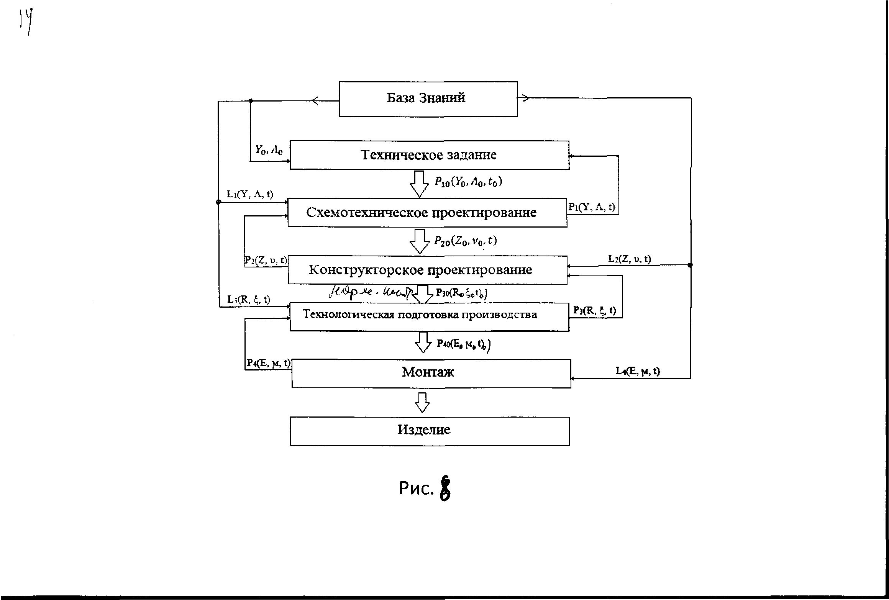

___
# Вопрос 30: Какая последовательность применения вероятностных оценок в процессе проектирования и производства КФС?
___

Начальные плотности вероятности распределения случайных функций $$ P_0(Y_0, {\Lambda}_0, t_0)  $$(ПВРСФ)   случайных величин (ПВРСВ) задаются по априорным данным (Т.З., «пересчет» ПВРСВ предыдущих параметров, в $$ \Lambda $$  по результатам конструкторских расчетов ПВРСВ и как пересчёт предыдущих параметров, $$ \xi $$ , полученных по результатам испытаний; ПВРСВ как пересчёт $$ \xi $$  по предыдущим ПВРСВ $$ \mu $$ полученным по техническим характеристикам комплектующих;

$$ L_1, L_2, L_3,L_4 $$ - операторы, ( математические модели) объекта проектирования на соотвествующих этапах.	

$$ P_{10}, P_{20}, P_{30}, P_{40} $$- начальные значения соответствующих плотностей вероятностей.

Y,Z,R,E – выходные переменные на соотвествующих этапах, случацные функии, макропеременные подлежающие изменению (оценке).
