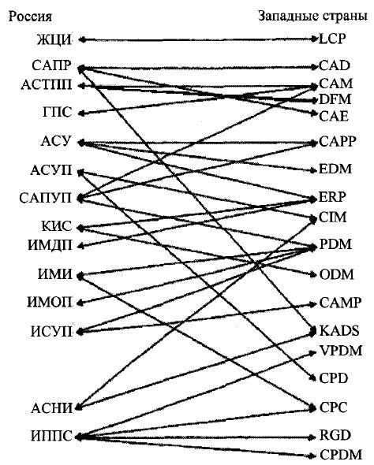

___
# Вопрос 5: Какие средства информационных технологий применяются в создании КФС?
___

Проектирование и производство приведенных в примерах КФС также как и многих невозможны без применения современных информационных технологий (ИТ). 
Многочисленные системы ИТ в виде САПР, АСТПП, ГПС и т.д представлены на рисунке с соответствующими англо-язычными аналогами.

ЖЦИ - Жизненный цикл изделия = LCP  - Life cycle Products 

САПР - Системы автоматизированного проектирования

АСТПП - Автоматизированая система технологической подготовки производства

ГПС - Гибкие производственные системы = САМ - Computer Aided Manufacturing

АСУ - Автоматизированные системы управления

АСУП - Автоматизированные системы управления производством

САПУП - система автоматического проектирования управляющих про¬грамм для станков с ЧПУ

ИМДП - информационная модель дискретного производства

ИМИ - информационная модель изделия

ИМОП - информационная модель объекта проектирования

ИСУП - интегрированная система управления предприятием

АСНИ - автоматизированная система научных исследований

ИППС - интегрированная проектно-производственная система

* CAD  - Computer Aided Ddesign 

* САМ - Computer Aided Manufacturing

* DFM - Design for Manufacturing

* СAE - Computer Aided Engineering

* CAPP - Computer Aided Product Planning

* EDM

* ERP 

* CIM - Computer Intégration Manufacturing

* PDM - Product Data Management

* ODM - 

* CAMP - Computer Aided Production Manufacturing

* KADS - Knowledge Acquisition and Design Support

* VPDM - 

* CPD - 

* CPC - 

* RGD - 

* CPDM - Collaborative Product Définition Management

* KADE - Intelligent Manufacturing Assisted Design Environment

* CAPP - Computer Aided Product Planning
