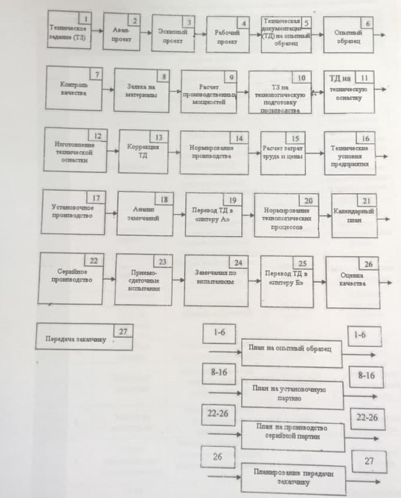

___
# Вопрос 8: Какие «обратные связи» существуют в процессе проектирования и производства?
___

*Источники: Консультация, Тема 2.doc*

## Информация с консультации:

Обратные связи идут в виде результатов лпбораторных испытаний. Никогда сразу сделать изделие так, чтобы оно точно удовлетворяло требованиям технического задания. Поэтому нужно проводить испытания на макетах и элементах и вводить обратные связи в документацию. Обратные связи идут по всему процессу. Существуют такие вещи, как извещение об изменении документации и предупреждения об изменении документации.

Обратные связи:

* Извещения об изменениях - изменение документации (ТЗ)

* Например, если не могут сделать продукт по представленному ТЗ

* Например, выполняем схему усилителя. При расчетах понимаем, что элементная база не соответствует ТЗ (На уровне схемотехнического проектирования)

## Информация из Темы 2 

На рисунке справа снизу изображено что-то похожее на обратные связи. Но не факт, что это подходит для ответа.

Подробнее об этапах в [Вопрос 6: Выделите в традиционном процессе проектирования и производства то, что относится к проектированию.](6.md).

