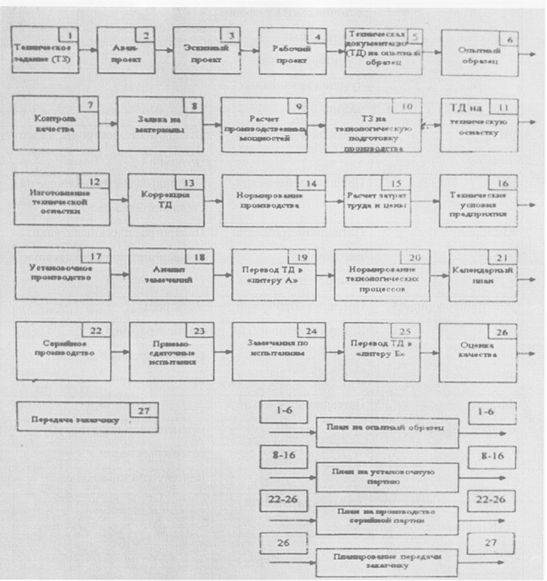

___
# Вопрос 8: Какие «обратные связи» существуют в процессе проектирования и производства?
___

*Источники: Тема 2.doc*

На рисунке изображено что-то похожее на обратные связи.

Выход с последней связи, скорее всего, должен идти на этап 26.  
Если это не так, эта связь не является обратной и её не нужно отвечать.  

Этапы перечислены в [Вопрос 6: Выделите в традиционном процессе проектирования и производства то, что относится к проектированию.](6.md).

