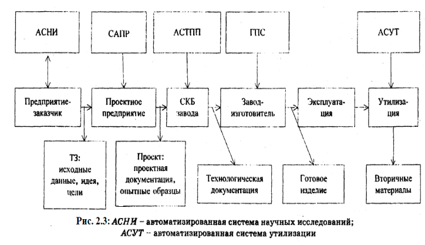
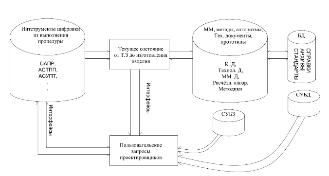

___
# Вопрос 9: Что собой представляют существующие средства «цифровизации» - АСНИ, САПР, АСТПП, ГПС?
___

«Цифровизация» традиционного процесса проектирования подразумевает сквозное «движение» математических моделей от технического задания до опытных образцов изделия и выполнение проектных и производственных процедур на основе этих моделей.

Основные инструменты обеспечивающие такое движение в виде АСНИ, САПР, АСТПП, ГПС, АСУТ. применяются на предприятиях в большом многообразии специальных средств информационных технологий (ИТ):
* САПР (CAD/CAM CATIA, UNIGRATH, PROENG
* Solid Work, Solid Edgo ... PTC ...);
* АСТПП (Technomatrix, PLM, NX CAM ...);
* ГПС (CAMExpress ...).

* АСНИ - автоматизированная система научных исследований;
* ГПС - гибкие производственные системы.

По сути это пользовательские инструменты для автоматизации сложных и где то рутинных операций (моделирования, построение чертежей, имитации, анализа мат моделей и так далее), автоматизация которая минимизирует время затраты человеческа, финансовые затраты, вероятность человеческой ошибки.

То что они из себя представляют представленно на картинке:

